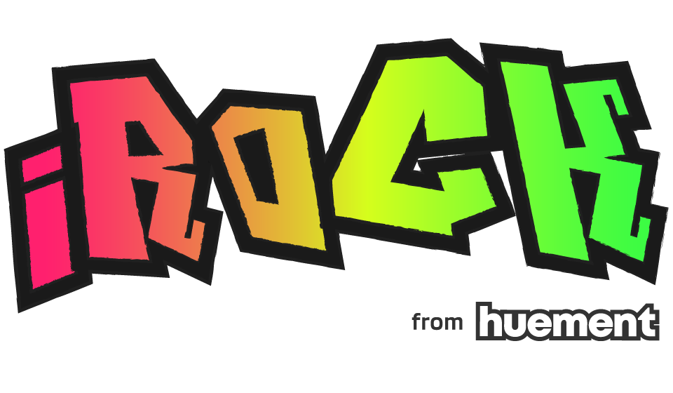

<h1 align="center">
   
  
   
</h1>

> using Bootstrap 5 to create a 'visually pleasing' harmonic layout based portfolio. Professional and hobby projects ive been involved in over the years

**iRock** really shines when you need a quick and easy portfolio website. It features a number of handy javascript libraries for displaying content and managing user experience, while not being bloated or complicated. The javascript is a 'light' touch.

**Pug.js** handles building out the actual HTML files via `npm run dev`. This also uses Dart-SASS and Postfix to compile the `.scss` into a nice style sheet that supports all modern standards.

_NOTE:_ If you want your own version, iRock is built to use Github Pages for hosting it, so there is no consideration given to using express or anything of that sort for a webserver.

------------------------

### Thanks for stopping by
